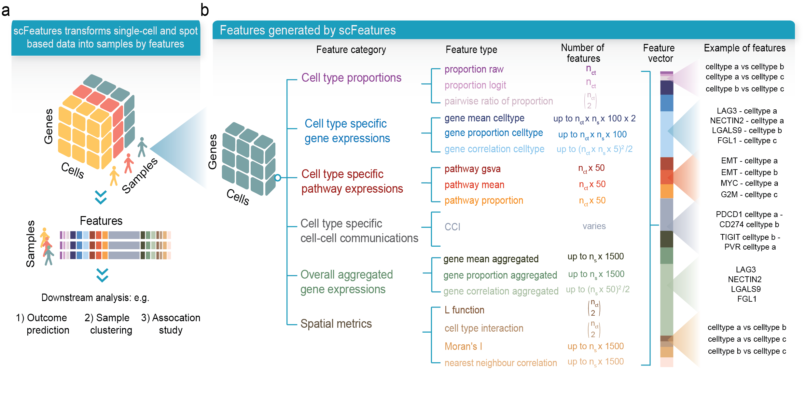

## scFeatures: Multi-view representations of single-cell and spatial data for disease outcome prediction


scFeatures is a tool that generates multi-view representations of single-cell and spatial data through the construction of a total of 17 feature types belonging to the following six categories. 

1. cell type proportions
2. cell type specific gene expressions
3. cell type specific pathway expressions
4. cell type specific cell-cell interaction (CCI) scores
5. overall aggregated gene expressions
6. spatial metrics



##  Installation 

The latest scFeatures can be installed using devtools: 

 ```
library(devtools)
devtools::install_github("SydneyBioX/scFeatures")
 ```
 
##  Vignettes
 
We provide two vignettes in the Vignettes folder of this repo. These can also be viewed below:      
  * [Brief vignette](https://htmlpreview.github.io/?https://github.com/SydneyBioX/scFeatures/blob/master/vignettes/Vignette_summary.html) - The brief vignette is a quick starting point and provides a checklist of the functions to apply on single-cell and spatial data.   
  * [Detailed vignette](https://htmlpreview.github.io/?https://github.com/SydneyBioX/scFeatures/blob/master/vignettes/Vignette_detail.html) - This provides an in-depth description for each feature types and explanation of the output. It contains a step-by-step case study to the application of scFeatures on i) scRNA-seq data, ii) spatial proteomics data and iii) spatial transcriptomics data   


## Reference
Cao, Y., Lin, Y., Patrick, E., Yang, P., & Yang, J. Y. H. (2022). scFeatures: Multi-view representations of single-cell and spatial data for disease outcome prediction. bioRxiv.